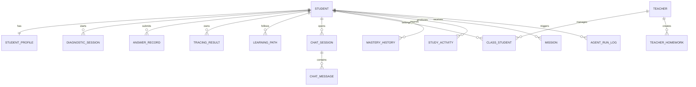

# SmartMentor 智导师系统数据库设计文档

## 1. 文档说明

本文档描述 SmartMentor 智导师系统的数据库设计，包括数据库环境、命名规范、概念模型、逻辑模型、核心表结构、关系设计、索引设计和数据安全要求。数据库设计依据当前 `smartmentor.sql` 初始化脚本和后端 JPA Entity 整理。

## 2. 数据库环境

| 项目 | 设计 |
| --- | --- |
| 数据库类型 | MySQL 8.0+ |
| 数据库名 | `smartmentor` |
| 存储引擎 | InnoDB |
| 字符集 | utf8mb4 |
| 排序规则 | utf8mb4_unicode_ci |
| ORM | Spring Data JPA / Hibernate |
| 缓存 | Redis |
| 时间格式 | Asia/Shanghai |

后端配置中使用 MySQL 连接参数、Redis 参数、JWT Secret、DeepSeek API Key 等环境变量注入，避免敏感信息硬编码。

## 3. 命名规范

1. 表名使用小写英文和下划线，如 `student_profile`。
2. 主键统一使用 `id`，业务唯一编号使用 `student_id`、`diagnostic_id`、`path_id`、`homework_id` 等字段。
3. 时间字段使用 `created_at`、`updated_at`、`finished_at`、`submitted_at` 等命名。
4. 外键字段以关联实体名加 `_id` 命名，如 `student_id`、`teacher_id`。
5. JSON 扩展字段用于保存结构变化较快的 AI 结果、题目快照、知识状态、错误模式等内容。

## 4. 数据库总体设计

系统数据可划分为九个主题域：

| 主题域 | 主要表 |
| --- | --- |
| 用户与认证 | `student`、`teacher`、`sms_code` |
| 学生画像 | `student_profile` |
| 知识图谱与题库 | `knowledge_point`、`knowledge_edge`、`student_knowledge_mastery`、`question`、`question_bank` |
| 诊断与答题 | `diagnostic_session`、`diagnostic_answer`、`answer_record` |
| 溯因分析 | `tracing_analysis`、`tracing_result` |
| 学习路径 | `learning_path`、`learning_path_node`、`lesson`、`exercise_submission`、`checkpoint_submission` |
| AI 对话 | `chat_session`、`chat_message` |
| 教师端 | `teacher_student`、`class_student`、`teacher_homework`、`homework_task`、`student_alert`、`weekly_report` |
| 学习行为与审计 | `study_log`、`study_activity`、`mastery_snapshot`、`mastery_history`、`mission_template`、`student_mission`、`mission`、`agent_run_log` |

其中，当前后端 Entity 直接映射的主要表包括：`student`、`teacher`、`student_profile`、`diagnostic_session`、`answer_record`、`tracing_result`、`learning_path`、`chat_session`、`chat_message`、`class_student`、`teacher_homework`、`question_bank`、`mastery_history`、`study_activity`、`mission`、`agent_run_log`。

## 5. 概念模型

核心实体关系如下：

## 6. 核心表结构设计

### 6.1 学生表 `student`

用途：保存学生账号与基础资料。

| 字段 | 类型 | 约束 | 说明 |
| --- | --- | --- | --- |
| `id` | BIGINT UNSIGNED | PK, AUTO_INCREMENT | 学生主键 |
| `phone` | VARCHAR(20) | NOT NULL, UNIQUE | 手机号/登录账号 |
| `password` | VARCHAR(128) | NOT NULL | BCrypt 密码哈希 |
| `nickname` | VARCHAR(50) | NULL | 昵称 |
| `grade` | VARCHAR(20) | NULL | 年级 |
| `school` | VARCHAR(100) | NULL | 学校 |
| `avatar_url` | VARCHAR(255) | NULL | 头像地址 |
| `role` | VARCHAR(20) | NOT NULL | 角色，默认 `student` |
| `created_at` | DATETIME | NOT NULL | 创建时间 |
| `updated_at` | DATETIME | NOT NULL | 更新时间 |

索引：`uk_phone(phone)`。

### 6.2 教师表 `teacher`

用途：保存教师账号与基础资料。

| 字段 | 类型 | 约束 | 说明 |
| --- | --- | --- | --- |
| `id` | BIGINT UNSIGNED | PK, AUTO_INCREMENT | 教师主键 |
| `phone` | VARCHAR(20) | NOT NULL, UNIQUE | 手机号/登录账号 |
| `password` | VARCHAR(128) | NOT NULL | BCrypt 密码哈希 |
| `name` | VARCHAR(50) | NULL | 教师姓名 |
| `school` | VARCHAR(100) | NULL | 学校 |
| `role` | VARCHAR(20) | NOT NULL | 角色，默认 `teacher` |
| `created_at` | DATETIME | NOT NULL | 创建时间 |
| `updated_at` | DATETIME | NOT NULL | 更新时间 |

索引：`uk_phone(phone)`。

### 6.3 验证码表 `sms_code`

用途：保存注册、登录或重置密码场景下的验证码。

| 字段 | 类型 | 说明 |
| --- | --- | --- |
| `id` | BIGINT UNSIGNED | 主键 |
| `phone` | VARCHAR(20) | 手机号或账号标识 |
| `code` | VARCHAR(10) | 验证码 |
| `purpose` | VARCHAR(20) | 用途：login/register/reset |
| `used` | TINYINT(1) | 是否已使用 |
| `expired_at` | DATETIME | 过期时间 |
| `created_at` | DATETIME | 创建时间 |

索引：`idx_phone_purpose(phone, purpose)`。

### 6.4 学生画像表 `student_profile`

用途：保存学生五维画像、学习偏好、能力参数和学习激励数据。

| 字段 | 类型 | 说明 |
| --- | --- | --- |
| `id` | BIGINT UNSIGNED | 主键 |
| `student_id` | BIGINT UNSIGNED | 学生 ID，唯一 |
| `knowledge_state` | DECIMAL(3,2) | 知识状态维度 |
| `error_pattern` | DECIMAL(3,2) | 错误模式维度 |
| `learning_behavior` | DECIMAL(3,2) | 学习行为维度 |
| `cognitive_style` | DECIMAL(3,2) | 认知风格维度 |
| `goal_profile` | DECIMAL(3,2) | 目标画像维度 |
| `learning_style` | VARCHAR(20) | 学习风格 |
| `daily_study_minutes` | INT | 每日学习时长 |
| `preferred_time_slot` | VARCHAR(20) | 偏好时段 |
| `target_school` | VARCHAR(100) | 目标院校 |
| `weak_module_priority` | JSON | 薄弱模块优先级 |
| `overall_mastery` | DECIMAL(3,2) | 综合掌握度 |
| `ability_param` | DECIMAL(5,2) | IRT 能力参数 |
| `error_patterns` | JSON | 错误模式统计 |
| `knowledge_state_json` | JSON | 知识状态快照 |
| `streak_days` | INT | 连续学习天数 |
| `total_study_hours` | DECIMAL(10,1) | 累计学习小时 |
| `level` | INT | 用户等级 |
| `experience_points` | INT | 经验值 |
| `last_diagnostic_at` | DATETIME | 最近诊断时间 |

约束：`student_id` 唯一，外键关联 `student(id)`。

### 6.5 知识点表 `knowledge_point`

用途：保存高中数学知识点基础信息。

| 字段 | 类型 | 说明 |
| --- | --- | --- |
| `id` | BIGINT UNSIGNED | 主键 |
| `knowledge_id` | VARCHAR(50) | 知识点编号 |
| `module` | VARCHAR(30) | 所属模块 |
| `name` | VARCHAR(100) | 知识点名称 |
| `description` | TEXT | 描述 |
| `difficulty` | DECIMAL(3,2) | 难度系数 |
| `importance` | INT | 重要度 |
| `sort_order` | INT | 排序 |
| `created_at` | DATETIME | 创建时间 |

索引：`uk_knowledge_id(knowledge_id)`、`idx_module(module)`。

### 6.6 知识点依赖边表 `knowledge_edge`

用途：表示知识点之间的前置依赖、关联或跨模块关系。

| 字段 | 类型 | 说明 |
| --- | --- | --- |
| `id` | BIGINT UNSIGNED | 主键 |
| `from_knowledge_id` | VARCHAR(50) | 前驱知识点 |
| `to_knowledge_id` | VARCHAR(50) | 后继知识点 |
| `weight` | DECIMAL(3,2) | 依赖强度 |
| `edge_type` | VARCHAR(20) | prerequisite/related/cross_module |
| `created_at` | DATETIME | 创建时间 |

索引：`uk_edge(from_knowledge_id, to_knowledge_id)`、`idx_from`、`idx_to`。

### 6.7 学生知识点掌握度表 `student_knowledge_mastery`

用途：保存学生对每个知识点的当前掌握情况。

| 字段 | 类型 | 说明 |
| --- | --- | --- |
| `id` | BIGINT UNSIGNED | 主键 |
| `student_id` | BIGINT UNSIGNED | 学生 ID |
| `knowledge_id` | VARCHAR(50) | 知识点编号 |
| `mastery` | DECIMAL(3,2) | 掌握度，0-1 |
| `status` | VARCHAR(20) | not_started/learning/mastered/weak |
| `attempt_count` | INT | 作答次数 |
| `correct_count` | INT | 正确次数 |
| `last_attempt_at` | DATETIME | 最近作答时间 |
| `updated_at` | DATETIME | 更新时间 |

索引：`uk_student_knowledge(student_id, knowledge_id)`、`idx_student`、`idx_knowledge`。

### 6.8 诊断会话表 `diagnostic_session`

用途：保存一次诊断测试的整体状态和结果。

| 字段 | 类型 | 说明 |
| --- | --- | --- |
| `id` | BIGINT UNSIGNED | 主键 |
| `session_id` / `diagnostic_id` | VARCHAR | 诊断业务编号 |
| `student_id` | BIGINT UNSIGNED | 学生 ID |
| `module` | VARCHAR(30) | 诊断模块 |
| `status` | VARCHAR(20) | in_progress/completed/abandoned |
| `total_questions` | INT | 总题数 |
| `correct_count` | INT | 正确数 |
| `accuracy` | DECIMAL(3,2) | 正确率 |
| `estimated_mastery` | DECIMAL(3,2) | 估计掌握度 |
| `weak_points` | JSON | 薄弱点 |
| `started_at` | DATETIME | 开始时间 |
| `finished_at` | DATETIME | 完成时间 |

索引：业务编号唯一索引，`student_id`、`student_id + module` 组合索引。

### 6.9 答题记录表 `answer_record`

用途：保存诊断、练习、检查点等场景下的答题明细。

| 字段 | 类型 | 说明 |
| --- | --- | --- |
| `id` | BIGINT | 主键 |
| `student_id` | BIGINT | 学生 ID |
| `diagnostic_id` | VARCHAR | 诊断编号 |
| `question_id` | VARCHAR | 题目编号 |
| `knowledge_point_id` | VARCHAR | 知识点编号 |
| `student_answer` | TEXT/VARCHAR | 学生答案 |
| `correct_answer` | TEXT/VARCHAR | 正确答案快照 |
| `is_correct` | TINYINT/BOOLEAN | 是否正确 |
| `score` | DECIMAL | 得分 |
| `time_spent` | INT | 耗时 |
| `created_at` | DATETIME | 创建时间 |

索引：`idx_answer_student`、`idx_answer_diagnostic`、`idx_answer_student_time`。

### 6.10 题库缓存表 `question_bank`

用途：保存 AI 生成或系统内置题目，用于复用、审核和 fallback。

| 字段 | 类型 | 说明 |
| --- | --- | --- |
| `id` | BIGINT | 主键 |
| `question_id` | VARCHAR | 题目编号 |
| `question_hash` | VARCHAR | 题目内容哈希 |
| `module` | VARCHAR | 数学模块 |
| `knowledge_point_id` | VARCHAR | 知识点编号 |
| `question_type` | VARCHAR | 题型 |
| `difficulty` | VARCHAR/DECIMAL | 难度 |
| `content` | TEXT | 题干 |
| `options_json` | JSON/TEXT | 选项 |
| `correct_answer` | TEXT | 正确答案 |
| `explanation` | TEXT | 解析 |
| `source` | VARCHAR | 来源 |
| `quality_score` | DECIMAL | 质量评分 |
| `created_at` | DATETIME | 创建时间 |

索引：`uk_question_hash`、`idx_question_bank_kp`、`idx_question_bank_module`。

### 6.11 溯因分析表 `tracing_result`

用途：保存薄弱知识点溯因结果。

| 字段 | 类型 | 说明 |
| --- | --- | --- |
| `id` | BIGINT | 主键 |
| `tracing_id` | VARCHAR | 溯因编号 |
| `student_id` | BIGINT | 学生 ID |
| `diagnostic_id` | VARCHAR | 诊断编号 |
| `module` | VARCHAR | 模块 |
| `trigger_knowledge_id` | VARCHAR | 触发知识点 |
| `root_causes_json` | JSON/TEXT | 根因列表 |
| `trace_paths_json` | JSON/TEXT | 溯因路径 |
| `summary` | TEXT | 分析摘要 |
| `recommendation` | TEXT | 建议 |
| `confidence` | DECIMAL | 可信度 |
| `created_at` | DATETIME | 创建时间 |

索引：`uk_tracing_result_id`、`idx_tracing_student`、`idx_tracing_diagnostic`。

### 6.12 学习路径表 `learning_path`

用途：保存学生个性化学习路径。

| 字段 | 类型 | 说明 |
| --- | --- | --- |
| `id` | BIGINT UNSIGNED | 主键 |
| `path_id` | VARCHAR(64) | 学习路径编号 |
| `student_id` | BIGINT UNSIGNED | 学生 ID |
| `title` | VARCHAR(100) | 路径标题 |
| `description` | TEXT | 路径说明 |
| `target_module` | VARCHAR(30) | 目标模块 |
| `root_knowledge_id` | VARCHAR(50) | 根因知识点 |
| `status` | VARCHAR(20) | 路径状态 |
| `progress` | DECIMAL(3,2) | 进度 |
| `estimated_days` | INT | 预计天数 |
| `nodes_json` | JSON/TEXT | 节点快照 |
| `created_at` | DATETIME | 创建时间 |
| `updated_at` | DATETIME | 更新时间 |

索引：`uk_path_id`、`idx_student`、`idx_student_status`。

### 6.13 对话会话表 `chat_session` 与消息表 `chat_message`

`chat_session` 保存学生 AI 对话会话，`chat_message` 保存每条用户消息和 AI 回复。

`chat_session` 关键字段：`session_id`、`student_id`、`title`、`created_at`、`updated_at`。

`chat_message` 关键字段：`session_id`、`role`、`content`、`created_at`。

索引：会话编号唯一索引、学生索引、`session_id + created_at` 组合索引。

### 6.14 班级学生关系表 `class_student`

用途：保存教师、班级、学生的关系。

| 字段 | 类型 | 说明 |
| --- | --- | --- |
| `id` | BIGINT | 主键 |
| `teacher_id` | BIGINT | 教师 ID |
| `class_name` | VARCHAR | 班级名称 |
| `student_id` | BIGINT | 学生 ID |
| `created_at` | DATETIME | 创建时间 |

索引：`idx_class_teacher`、`idx_class_teacher_name`、`idx_class_student`。

### 6.15 教师分层作业表 `teacher_homework`

用途：保存教师生成的分层作业。

| 字段 | 类型 | 说明 |
| --- | --- | --- |
| `id` | BIGINT | 主键 |
| `homework_id` | VARCHAR | 作业编号 |
| `teacher_id` | BIGINT | 教师 ID |
| `class_name` | VARCHAR | 班级 |
| `title` | VARCHAR | 作业标题 |
| `target_knowledge_points_json` | JSON/TEXT | 目标知识点 |
| `tiered_questions_json` | JSON/TEXT | 分层题目 |
| `student_groups_json` | JSON/TEXT | 学生分层 |
| `created_at` | DATETIME | 创建时间 |

索引：`uk_teacher_homework_id`、`idx_teacher_homework_class`、`idx_teacher_homework_created`。

### 6.16 掌握度历史表 `mastery_history`

用途：记录学生知识点掌握度变化，用于学习报告和趋势分析。

| 字段 | 类型 | 说明 |
| --- | --- | --- |
| `id` | BIGINT | 主键 |
| `student_id` | BIGINT | 学生 ID |
| `knowledge_point_id` | VARCHAR | 知识点编号 |
| `before_mastery` | DECIMAL | 更新前掌握度 |
| `after_mastery` | DECIMAL | 更新后掌握度 |
| `change_reason` | VARCHAR | 变化原因 |
| `created_at` | DATETIME | 创建时间 |

索引：`idx_mastery_student`、`idx_mastery_student_time`、`idx_mastery_student_kp`。

### 6.17 学习活动表 `study_activity`

用途：记录学生学习行为，如诊断、练习、课程学习、任务完成等。

| 字段 | 类型 | 说明 |
| --- | --- | --- |
| `id` | BIGINT | 主键 |
| `student_id` | BIGINT | 学生 ID |
| `activity_type` | VARCHAR | 活动类型 |
| `activity_date` | DATE/DATETIME | 活动日期 |
| `duration_minutes` | INT | 学习时长 |
| `detail_json` | JSON/TEXT | 详情 |
| `created_at` | DATETIME | 创建时间 |

索引：`idx_activity_student`、`idx_activity_student_date`、`idx_activity_student_type`。

### 6.18 Agent 运行日志表 `agent_run_log`

用途：审计 AI Agent 调用过程，便于调试、质量评估和问题追踪。

| 字段 | 类型 | 说明 |
| --- | --- | --- |
| `id` | BIGINT | 主键 |
| `run_id` | VARCHAR | 运行编号 |
| `student_id` | BIGINT | 学生 ID |
| `agent_name` | VARCHAR | Agent 名称 |
| `model` | VARCHAR | 模型名称 |
| `prompt_version` | VARCHAR | 提示词版本 |
| `prompt_hash` | VARCHAR | 提示词哈希 |
| `input_summary` | TEXT | 输入摘要 |
| `output_summary` | TEXT | 输出摘要 |
| `latency_ms` | INT | 调用耗时 |
| `success` | TINYINT | 是否成功 |
| `fallback` | TINYINT | 是否 fallback |
| `quality_score` | DECIMAL | 质量评分 |
| `error_message` | TEXT | 错误信息 |
| `created_at` | DATETIME | 创建时间 |

索引：`idx_agent_run_student`、`idx_agent_run_agent`、`idx_agent_run_created`。

## 7. 关系设计

1. `student_profile.student_id` 与 `student.id` 一对一。
2. `diagnostic_session.student_id` 与 `student.id` 一对多。
3. `student_knowledge_mastery.student_id` 与 `student.id` 一对多，`knowledge_id` 对应知识点业务编号。
4. `learning_path.student_id` 与 `student.id` 一对多。
5. `chat_session.student_id` 与 `student.id` 一对多，`chat_message.session_id` 与 `chat_session.session_id` 一对多。
6. `class_student.teacher_id`、`class_student.student_id` 分别关联教师和学生，用于班级管理。
7. `teacher_homework.teacher_id` 关联教师，作业内容通过 JSON 记录分层题目和学生分组。
8. `mastery_history`、`study_activity`、`mission` 以 `student_id` 聚合学生长期行为数据。
9. `agent_run_log` 通过 `student_id` 和 `agent_name` 支持按学生、Agent 和时间维度审计。

## 8. 索引设计

| 场景 | 索引字段 | 目的 |
| --- | --- | --- |
| 登录查询 | `student.phone`、`teacher.phone` | 快速定位账号 |
| 诊断历史 | `diagnostic_session.student_id`、`student_id + module` | 查询学生诊断记录 |
| 答题记录 | `answer_record.student_id`、`diagnostic_id`、`student_id + created_at` | 统计答题表现 |
| 知识点查询 | `knowledge_point.module`、`knowledge_id` | 按模块加载知识点 |
| 掌握度查询 | `student_knowledge_mastery.student_id + knowledge_id` | 查询单个学生知识掌握 |
| 学习路径 | `learning_path.student_id + status` | 查询当前路径 |
| 教师班级 | `class_student.teacher_id + class_name` | 查询班级学生 |
| 教师作业 | `teacher_homework.teacher_id + class_name`、`created_at` | 查询作业历史 |
| Agent 审计 | `agent_run_log.student_id`、`agent_name`、`created_at` | 排查 AI 调用 |

## 9. JSON 字段设计

系统大量使用 AI 生成内容和结构化结果，部分数据适合使用 JSON 保存：

| 字段 | 内容 |
| --- | --- |
| `weak_points` | 诊断出的薄弱知识点列表 |
| `root_causes_json` | 溯因根因知识点列表 |
| `trace_paths_json` | 知识依赖路径 |
| `nodes_json` | 学习路径节点快照 |
| `tiered_questions_json` | 分层作业题目 |
| `student_groups_json` | 学生分层结果 |
| `error_patterns` | 错误模式统计 |
| `knowledge_state_json` | 学生知识状态快照 |

JSON 字段适合快速迭代和演示，但高频筛选字段应保留独立列，避免后期查询性能不足。

## 10. 数据一致性设计

1. 用户账号使用唯一索引防止重复注册。
2. 学生画像与学生为一对一关系，删除学生时级联删除画像。
3. 诊断、学习路径、对话、任务、掌握度历史均以 `student_id` 为归属字段。
4. 作业、班级和周报均以 `teacher_id` 为归属字段。
5. 诊断题目和练习判题应保存服务端题目快照，避免前端篡改正确答案。
6. Agent 结果写入业务表前应进行结构校验，失败时记录到 `agent_run_log`。

## 11. 数据安全设计

1. 密码字段只保存 BCrypt 哈希。
2. JWT Secret、数据库密码、Redis 密码、邮箱授权码、DeepSeek API Key 不入库、不提交代码。
3. 学生只能访问自己的诊断、学习路径、报告和作业。
4. 教师只能访问自己班级的学生和作业数据。
5. AI 调用日志只保存摘要和必要审计信息，不应保存敏感原文。
6. 生产环境应定期备份 MySQL，并对关键表做恢复演练。

## 12. Redis 设计

Redis 用于非持久化或可恢复数据：

| Key 类型 | 示例 | 说明 |
| --- | --- | --- |
| 验证码 | `sms:login:{phone}` | 保存短期验证码 |
| 限流 | `rate:{ip}:{path}` | 控制接口访问频率 |
| 会话辅助 | `chat:stream:{sessionId}` | 流式响应临时状态 |
| 缓存 | `kg:module:{module}` | 知识图谱或题库临时缓存 |

Redis 中的数据应设置合理 TTL，业务核心数据仍以 MySQL 为准。

## 13. 后续优化建议

1. 将 `knowledge_point`、`knowledge_edge` 与资源目录中的知识图谱 JSON 建立稳定同步机制。
2. 对 `question_bank` 增加审核状态、使用次数、正确率统计，提高题目质量管理能力。
3. 将 `teacher_homework` 的分层题目拆分为作业主表、作业题目表、学生作业表，便于支持提交和批改。
4. 对高频报告查询建立汇总表或定时统计任务。
5. 对 AI 生成的 JSON 增加 schema 校验和版本字段，避免后续结构变化影响旧数据。
