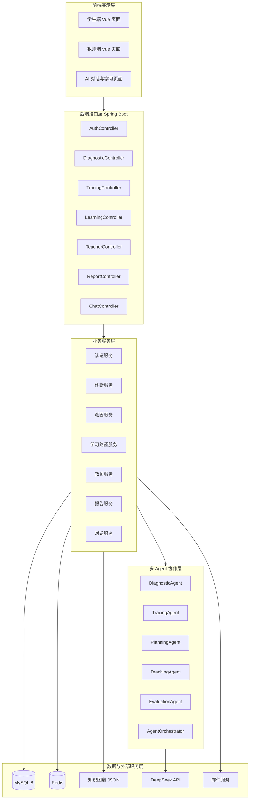
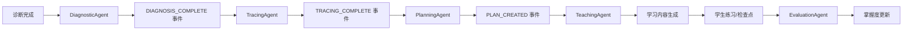
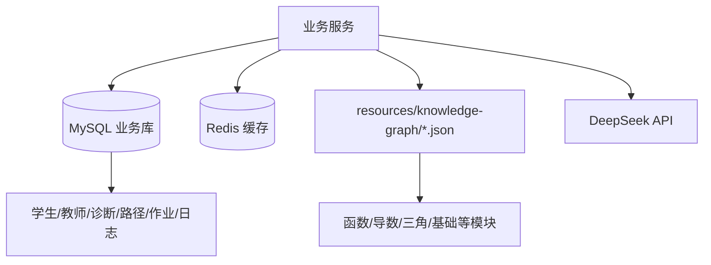
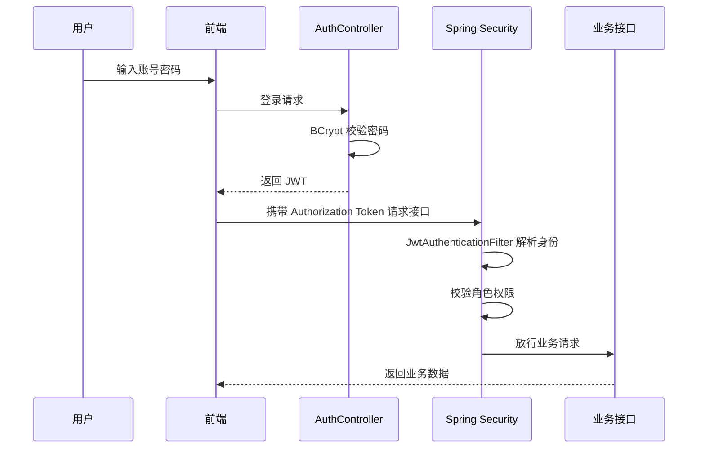
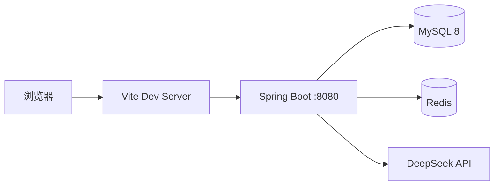

# SmartMentor 智导师系统架构文档

## 1. 文档说明

本文档描述 SmartMentor 智导师系统的整体架构、技术选型、分层设计、后端架构、前端架构、多 Agent 架构、数据架构、安全架构、部署架构和可扩展设计。文档依据当前代码结构整理：后端为 `SmartMentor`，前端为 `smartmentor-web`。

## 2. 架构目标

SmartMentor 的架构目标包括：

1. 支撑学生端和教师端的完整学习/教学闭环。
2. 采用前后端分离模式，便于独立开发、部署和演示。
3. 后端采用清晰的 Controller、Service、Repository、Entity 分层。
4. 通过多 Agent 编排承载诊断、溯因、规划、教学和评估流程。
5. 使用 MySQL 保存核心业务数据，Redis 承载缓存、验证码和限流等辅助能力。
6. 通过 JWT 和 Spring Security 实现无状态认证和角色权限隔离。
7. 通过日志审计、fallback 和离线演示模式降低大模型不可用风险。

## 3. 总体架构



## 4. 技术架构选型

| 层级 | 技术 | 说明 |
| --- | --- | --- |
| 前端 | Vue 3、Vue Router、Vite | 构建学生端和教师端 SPA |
| 前端渲染 | KaTeX、marked、Remix Icon | 数学公式、Markdown 内容、图标 |
| 后端 | Java 17、Spring Boot 2.7.18 | REST API 与业务服务 |
| 安全 | Spring Security、JWT、BCrypt | 认证、授权、密码加密 |
| 持久层 | Spring Data JPA、Hibernate | Entity/Repository 数据访问 |
| 数据库 | MySQL 8 | 业务数据持久化 |
| 缓存 | Redis | 验证码、缓存、限流、临时状态 |
| AI 调用 | OkHttp、DeepSeek API | 大模型请求 |
| 邮件 | Spring Mail | 验证码或通知邮件 |
| 构建 | Maven Wrapper、npm | 后端和前端构建运行 |

## 5. 后端分层架构

后端采用典型 Spring Boot 分层结构：

```text
com.tricia.smartmentor
├── agent          多 Agent 定义、响应、上下文和编排器
├── common         统一返回结构、业务异常、全局异常处理
├── config         安全、JWT、Redis、Web 配置
├── controller     REST API 控制器
├── dto            请求和响应 DTO
├── entity         JPA 实体
├── repository     Spring Data JPA Repository
├── service        业务服务
└── util           工具类
```

### 5.1 Controller 层

Controller 层负责接收 HTTP 请求、校验入口参数、提取当前用户身份并调用业务服务。当前主要控制器如下：

| 控制器 | 路径 | 职责 |
| --- | --- | --- |
| `AuthController` | `/api/auth` | 注册、登录、验证码、当前用户 |
| `ProfileController` | `/api/profile` | 学生画像、设置、知识图谱概览 |
| `DiagnosticController` | `/api/diagnostic` | 诊断开始、提交、完成、历史、结果 |
| `TracingController` | `/api/tracing` | 薄弱知识溯因分析与结果查询 |
| `LearningController` | `/api/learning` | 学习路径、课程、练习、检查点 |
| `ChatController` | `/api/chat` | AI 流式对话与历史 |
| `EngagementController` | `/api/engagement` | 每日任务与完成 |
| `ReportController` | `/api/report` | 学习效果报告与看板 |
| `TeacherController` | `/api/teacher` | 教师班级、热力图、作业、预警、周报 |
| `StudentHomeworkController` | `/api/homework` | 学生查看教师作业 |

### 5.2 Service 层

Service 层承载业务规则，是系统核心。典型服务包括：

| 服务 | 职责 |
| --- | --- |
| `AuthService` | 用户注册、登录、密码加密、Token 生成 |
| `DiagnosticService` | 诊断流程、题目生成/读取、答题记录、结果计算 |
| `TracingService` | 知识薄弱根因分析 |
| `LearningService` | 学习路径、课程、练习与检查点 |
| `ChatService` | AI 对话、会话和消息历史 |
| `DeepSeekService` | 大模型接口调用 |
| `KnowledgeGraphService` | 加载和查询知识图谱元数据 |
| `MasteryUpdateService` | 学生掌握度更新 |
| `TeacherService` | 班级管理、热力图、分层作业、预警 |
| `StudentHomeworkService` | 学生作业查询 |
| `ReportService` | 学习报告和数据看板 |
| `OfflineDemoService` | 模型不可用时的演示数据 fallback |
| `PromptTemplateService` | Agent 提示词模板加载 |

### 5.3 Repository 与 Entity 层

Repository 层使用 Spring Data JPA 操作 MySQL。Entity 层与主要业务表对应，如 `Student`、`Teacher`、`StudentProfile`、`DiagnosticSession`、`AnswerRecord`、`TracingResult`、`LearningPath`、`ChatSession`、`ChatMessage`、`TeacherHomework`、`QuestionBank`、`AgentRunLog` 等。

### 5.4 Common 与 Config 层

`common` 包提供统一响应 `Result`、业务异常 `BusinessException` 和全局异常处理器。`config` 包提供 JWT 工具、认证过滤器、安全配置、Redis 配置、Web 配置和限流拦截器。

## 6. 前端架构

前端项目采用 Vue 3 + Vite。目录结构如下：

```text
smartmentor-web
├── src
│   ├── api          后端接口封装
│   ├── assets/css   样式资源
│   ├── components   通用组件
│   ├── composables  状态与组合式逻辑
│   ├── router       路由配置
│   ├── views        页面视图
│   ├── App.vue
│   └── main.js
├── package.json
└── vite.config.js
```

主要页面包括：

| 页面 | 说明 |
| --- | --- |
| `Landing.vue` | 首页/入口 |
| `Auth.vue` | 登录注册 |
| `Dashboard.vue` | 学生仪表盘 |
| `Diagnostic.vue` | 开始诊断 |
| `DiagnosticResult.vue` | 诊断结果 |
| `DiagnosticHistory.vue` | 诊断历史 |
| `TracingResult.vue` | 溯因结果 |
| `LearningPaths.vue` | 学习路径列表 |
| `LearningPathDetail.vue` | 学习路径详情 |
| `Lesson.vue` | 课程、练习和检查点 |
| `Chat.vue` | AI 对话 |
| `Report.vue` | 学习报告 |
| `Profile.vue` | 个人设置 |
| `TeacherDashboard.vue` | 教师端仪表盘 |
| `StudentHomework.vue` | 学生作业 |

前端通过 `src/api/index.js` 统一封装 API 请求，通过 Vue Router 处理学生端与教师端页面跳转，通过本地状态保存当前用户和 Token。

## 7. 多 Agent 架构

系统将 AI 能力拆分为多个专业 Agent，并由 `AgentOrchestrator` 统一编排。



### 7.1 Agent 组成

| Agent | 输入 | 输出 |
| --- | --- | --- |
| DiagnosticAgent | 诊断记录、答题情况、题目知识点 | 薄弱点、错误模式、建议溯因方向 |
| TracingAgent | 薄弱点、知识图谱、掌握度 | 根因知识点、溯因路径、解释 |
| PlanningAgent | 根因知识点、学习偏好、目标 | 学习路径、节点顺序、预计用时 |
| TeachingAgent | 路径节点、知识点元数据 | 讲解内容、例题、练习题 |
| EvaluationAgent | 学生答案、正确答案、解析规则 | 判题结果、反馈、掌握度变化 |

### 7.2 编排机制

`AgentOrchestrator` 支持两种模式：

1. 事件驱动模式：注册事件处理器，通过 `fireEvent` 触发事件并支持级联执行。
2. Pipeline 模式：按顺序执行多个 Agent，适合诊断 - 溯因 - 规划等线性流程。

为防止事件链路无限递归，编排器设置最大协作轮次。每个 Agent 的输出会合并到 `AgentContext` 中，供后续 Agent 使用。

### 7.3 提示词与审计

提示词模板位于 `src/main/resources/prompts/`，包括诊断、溯因、规划、教学、评估等系统提示词。Agent 调用过程写入 `agent_run_log`，记录模型、提示词版本、输入摘要、输出摘要、耗时、成功状态和 fallback 状态。

## 8. 数据架构

数据架构由 MySQL、Redis、知识图谱 JSON 和外部大模型组成。



### 8.1 MySQL

MySQL 保存核心业务数据，包括用户、画像、诊断、答题、溯因、学习路径、聊天、教师作业、学习活动、任务和 Agent 日志。

### 8.2 Redis

Redis 主要用于验证码、缓存、接口限流和临时状态。Redis 数据可重建，不能作为核心业务数据的唯一来源。

### 8.3 知识图谱资源

知识图谱元数据位于 `src/main/resources/knowledge-graph/`，当前包含 `foundations.json`、`functions.json`、`derivatives.json`、`trigonometry.json` 等文件。系统可根据知识点前置依赖、常见错误、考试权重和预计学习时长生成学习路径和教师作业。

### 8.4 大模型服务

后端通过 `DeepSeekService` 调用 DeepSeek API。模型名称、Base URL 和 API Key 由环境变量配置。AI 调用应具备超时控制、结构化输出校验、fallback 和审计日志。

## 9. 接口架构

接口遵循 REST 风格，并统一返回 `Result` 结构。主要接口分组如下：

| 分组 | 关键接口 |
| --- | --- |
| 认证 | `POST /api/auth/captcha/email`、`POST /api/auth/register`、`POST /api/auth/login`、`GET /api/auth/me` |
| 画像 | `GET /api/profile/overview`、`PUT /api/profile/settings`、`GET /api/profile/knowledge-map` |
| 诊断 | `POST /api/diagnostic/start`、`POST /api/diagnostic/submit`、`POST /api/diagnostic/finish`、`GET /api/diagnostic/history`、`GET /api/diagnostic/result/{diagnosticId}` |
| 溯因 | `POST /api/tracing/analyze`、`GET /api/tracing/result/{tracingId}` |
| 学习 | `POST /api/learning/path/generate`、`GET /api/learning/path`、`GET /api/learning/path/{pathId}`、`GET /api/learning/lesson/{pathId}/{nodeId}`、`POST /api/learning/exercise/submit`、`POST /api/learning/checkpoint/submit` |
| 对话 | `GET /api/chat/stream`、`GET /api/chat/history` |
| 报告 | `GET /api/report/effectiveness`、`GET /api/report/dashboard` |
| 任务 | `GET /api/engagement/missions`、`POST /api/engagement/missions/{missionId}/complete` |
| 教师 | `GET /api/teacher/class/students`、`POST /api/teacher/class/students`、`GET /api/teacher/class/heatmap`、`GET /api/teacher/class/knowledge-point/{knowledgePointId}/students`、`POST /api/teacher/homework/generate`、`GET /api/teacher/homework`、`GET /api/teacher/alerts`、`GET /api/teacher/report/weekly` |
| 学生作业 | `GET /api/homework`、`GET /api/homework/{homeworkId}` |

## 10. 安全架构



安全设计要点：

1. 登录后使用 JWT 进行无状态认证。
2. 密码使用 BCrypt 加密。
3. Spring Security 按路径限制学生和教师角色。
4. 未认证返回 401，权限不足返回 403。
5. 跨域通过 CORS 配置支持前后端分离联调。
6. 敏感配置从环境变量读取，不进入代码仓库。

## 11. 部署架构

本地演示部署如下：



### 11.1 后端启动

```powershell
cd D:\Idea\中国软件杯\SmartMentor
.\mvnw.cmd spring-boot:run
```

后端默认监听 `http://localhost:8080`。

### 11.2 前端启动

```powershell
cd D:\Idea\中国软件杯\smartmentor-web
npm install
npm run dev
```

前端由 Vite 提供开发服务器。

### 11.3 运行依赖

| 依赖 | 说明 |
| --- | --- |
| JDK 17 | 后端运行 |
| MySQL 8 | 数据库 |
| Redis 6+ | 缓存 |
| Node.js/npm | 前端运行 |
| DeepSeek API Key | AI 能力 |
| 邮箱授权码 | 验证码或通知邮件 |

## 12. 可扩展设计

### 12.1 作业闭环扩展

当前系统已支持教师生成分层作业和学生查看作业。后续可扩展作业提交表、作业批改表、作业完成统计表，使作业闭环从“生成 - 查看”扩展到“提交 - 批改 - 统计 - 反馈”。

### 12.2 知识图谱扩展

知识图谱当前通过 JSON 和数据库表结合管理。后续如果知识点和关系规模扩大，可引入图数据库或图计算服务，但当前课程设计规模下，MySQL + JSON 资源文件已足够支撑演示。

### 12.3 题库质量管理

`question_bank` 可扩展审核状态、使用次数、正确率、区分度、质量标签等字段，从 AI 生成题库逐步演进为可管理题库。

### 12.4 多模型适配

可以在 `DeepSeekService` 上抽象模型调用接口，增加不同模型供应商适配器。Agent 层只依赖统一的模型服务，避免业务逻辑与具体模型 API 强绑定。

### 12.5 报告与统计优化

当学习活动数据增多后，可通过定时任务生成日报、周报和掌握度汇总表，减少实时聚合查询压力。

## 13. 架构风险与应对

| 风险 | 表现 | 应对 |
| --- | --- | --- |
| 大模型输出不稳定 | JSON 格式错误、内容偏离、响应超时 | 结构化提示词、输出校验、fallback、Agent 日志 |
| 数据结构快速变化 | AI 结果字段频繁调整 | 使用 JSON 字段保存快照，并增加版本字段 |
| 权限错误 | 学生访问教师接口或越权访问他人数据 | Spring Security 路径权限 + Service 层归属校验 |
| 本地环境依赖多 | MySQL、Redis、API Key 缺失导致演示失败 | `.env.example`、离线演示模式、模板题库 |
| 业务逻辑膨胀 | Service 过大、Agent 耦合业务 | 保持 Controller-Service-Repository 分层，Agent 输入输出通过 Context/Response 传递 |

## 14. 结论

SmartMentor 采用前后端分离、Spring Boot 分层后端、Vue 单页前端、MySQL/Redis 数据支撑和多 Agent 智能编排的整体架构。该架构能够覆盖学生个性化学习和教师教学辅助两类核心场景，既满足 Java 期末大作业的工程完整性，也为后续扩展作业批改、题库审核、知识图谱增强和多模型适配保留了空间。
