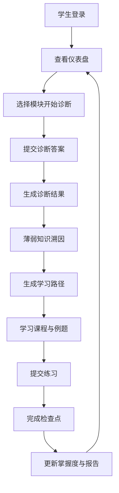
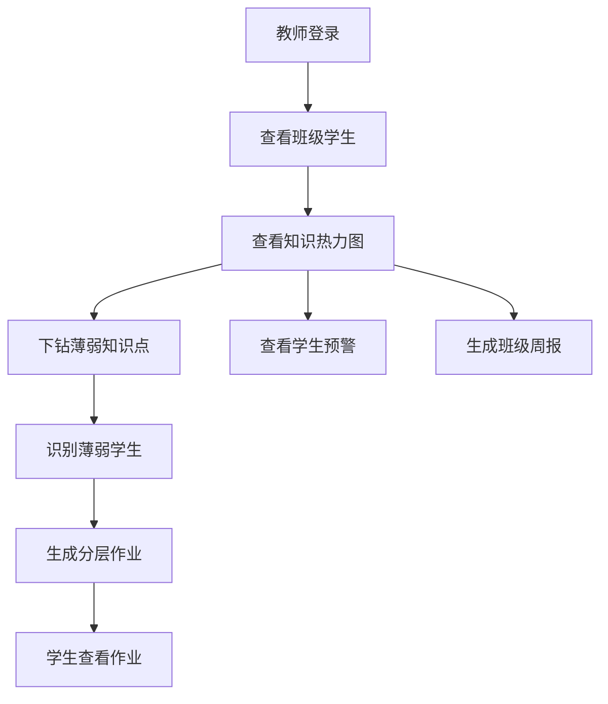
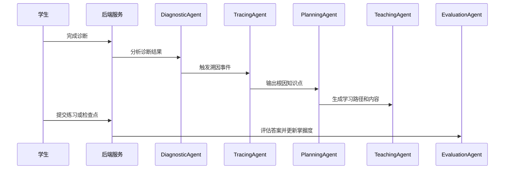

# SmartMentor 智导师系统需求分析文档

## 1. 文档说明

本文档面向 SmartMentor 智导师系统的 Java 期末大作业交付，描述系统建设背景、用户角色、业务目标、功能需求、非功能需求、业务流程、数据需求与验收标准。文档依据当前项目代码与资料整理，后端项目位于 `SmartMentor`，前端项目位于 `smartmentor-web`，数据库脚本为 `smartmentor.sql`。

## 2. 项目概述

SmartMentor 是一个面向高中数学学习场景的智能辅导平台。系统围绕“诊断 - 溯因 - 规划 - 学习 - 评估 - 反馈”的闭环，为学生提供薄弱知识点诊断、错因追溯、个性化学习路径、AI 辅导对话、学习报告等能力；同时为教师提供班级学生管理、知识掌握热力图、分层作业生成、学生预警和班级周报等教学辅助能力。

系统采用前后端分离架构：前端使用 Vue 3 + Vite 构建学生端与教师端页面，后端使用 Java 17 + Spring Boot 2.7.18 提供 REST API、认证授权、业务服务和多 Agent 编排能力；数据侧使用 MySQL 8 保存业务数据，Redis 用于缓存、会话与限流等场景，大模型能力通过 DeepSeek API 接入。

## 3. 建设背景与问题分析

高中数学学习存在知识链条长、前置依赖强、错误原因隐蔽等特点。学生在做错某道题后，表面上暴露的是当前知识点不会，实际原因可能来自更基础的函数、方程、图像理解或运算能力薄弱。传统题库系统通常只能完成刷题和判题，难以定位深层知识断点；普通 AI 问答工具虽然能够解释题目，但缺少学生长期学习画像和知识图谱约束，无法稳定形成个性化学习闭环。

教师侧也面临班级学生数量多、薄弱点分布复杂、个别化辅导成本高的问题。教师需要快速看到班级整体掌握情况，识别薄弱知识点和风险学生，并按学生层次生成不同难度的作业。

SmartMentor 的建设目标是将知识图谱、多 Agent 协作和学习数据分析结合起来，不只回答“学生错在哪里”，还要分析“为什么错”，并进一步给出“下一步怎么学”。

## 4. 用户角色

| 角色 | 说明 | 主要诉求 |
| --- | --- | --- |
| 学生 | 高中数学学习者 | 完成诊断、查看薄弱点、获取学习路径、进行 AI 辅导、完成练习和作业 |
| 教师 | 班级数学教师 | 管理班级学生、查看知识热力图、生成分层作业、查看预警和周报 |
| 系统管理员/运维 | 部署与维护人员 | 管理系统配置、数据库、日志、模型密钥和运行状态 |
| AI Agent | 系统内部智能体 | 完成诊断、溯因、规划、教学、评估等自动化任务 |

## 5. 总体业务目标

1. 支持学生注册、登录、个人画像维护和学习状态查看。
2. 支持学生完成数学模块诊断，并记录诊断过程、答题记录、正确率和薄弱点。
3. 基于知识图谱和学生掌握度，追溯薄弱知识点的根因。
4. 根据诊断与溯因结果，为学生生成个性化学习路径。
5. 提供课程讲解、练习提交、检查点评估和学习报告，形成学习效果闭环。
6. 支持 AI 对话辅导，并保存会话历史。
7. 支持教师管理班级学生、查看班级知识掌握分布、生成分层作业和班级周报。
8. 通过 JWT、角色权限、密码加密、接口限流、Agent 调用审计等机制保证系统可控运行。

## 6. 功能需求

### 6.1 用户认证与权限

系统应提供学生和教师的注册、登录、验证码发送、当前用户信息查询能力。用户密码使用 BCrypt 哈希保存，登录成功后由后端签发 JWT。前端在后续请求中携带 Token，后端通过过滤器解析用户身份。

权限要求如下：

| 接口范围 | 访问角色 |
| --- | --- |
| `/api/auth/register`、`/api/auth/login`、`/api/auth/captcha/**` | 未登录用户 |
| `/api/teacher/**` | 教师 |
| `/api/diagnostic/**`、`/api/learning/**`、`/api/tracing/**`、`/api/report/**`、`/api/engagement/**`、`/api/homework/**` | 学生 |
| 其他 `/api/**` | 已登录用户 |

### 6.2 学生端功能

#### 6.2.1 学生仪表盘

学生登录后应能查看个人学习概览，包括综合掌握度、累计学习时长、连续学习天数、任务完成情况、知识点掌握状态和近期学习活动。

#### 6.2.2 个人画像与设置

系统应支持维护学生个人信息和学习偏好，包括昵称、年级、学校、目标院校、学习风格、每日学习时长、偏好学习时段、薄弱模块优先级等。系统根据诊断与学习记录维护五维画像：知识状态、错误模式、学习行为、认知风格和目标画像。

#### 6.2.3 自适应诊断

学生可以选择数学模块发起诊断。系统生成或读取诊断题目，记录诊断会话、题目快照、学生答案、耗时、正确性和信心度。诊断完成后，系统计算正确率、估计掌握度和薄弱知识点列表。

核心要求：

1. 支持开始诊断、提交单题答案、完成诊断、查看历史诊断和诊断结果。
2. 诊断题目应关联知识点、难度、题型、正确答案和解析。
3. 判题应以服务端保存的题目快照为依据，避免依赖前端传入的正确答案。
4. 诊断结果应能触发后续溯因分析和学习路径生成。

#### 6.2.4 薄弱知识溯因

系统应根据诊断薄弱点、知识图谱前置关系和学生掌握度，分析导致错误的根因知识点。溯因结果应包含触发知识点、根因知识点、依赖路径、分析摘要、改进建议和可信度。

示例：学生在“导数应用”中表现较弱，系统可沿知识依赖追溯到“导数计算”“平均变化率”“函数图像”等前置知识，找到真正需要优先补齐的根因。

#### 6.2.5 个性化学习路径

系统应基于诊断结果和溯因结果生成学习路径。学习路径由若干节点组成，每个节点关联知识点、学习目标、推荐课程、练习任务、预计用时和当前状态。学生可查看路径列表、路径详情和具体课程内容。

学习路径状态应至少包括：未开始、学习中、已完成、已归档。

#### 6.2.6 课程、练习与检查点

系统应支持根据学习路径节点展示课程内容，课程内容包括知识讲解、例题、解题步骤和练习题。学生完成练习后提交答案，系统进行判题并反馈解析。检查点用于评估某一阶段学习成果，系统根据检查点结果更新掌握度和路径状态。

要求：

1. 练习与检查点均应记录提交记录。
2. 掌握度变化应写入历史表，便于后续报告与趋势分析。
3. 题目与答案应尽量使用服务端快照或题库数据，避免前端伪造评分依据。

#### 6.2.7 AI 对话辅导

学生可在学习过程中使用 AI 聊天功能进行题目讲解、知识点问答和学习建议咨询。系统应支持流式响应、会话历史查询，并将用户消息和 AI 回复保存到数据库。

#### 6.2.8 每日任务与学习激励

系统应为学生生成每日学习任务，记录任务完成状态、任务日期、奖励经验值等信息。学生完成任务后更新经验值、等级、连续学习天数等学习激励指标。

#### 6.2.9 学习报告

系统应提供学习效果报告和个人看板，展示诊断正确率、知识掌握变化、学习活动、薄弱模块、提升建议等信息。

#### 6.2.10 学生作业

教师生成分层作业后，学生应能在“我的作业”中查看自己所属层级的作业内容，并查看作业详情。后续可扩展作业提交、批改、完成率统计等能力。

### 6.3 教师端功能

#### 6.3.1 班级学生管理

教师可查看班级学生列表，并添加学生到指定班级。系统应保存教师、班级和学生之间的关系。

#### 6.3.2 班级知识热力图

教师可查看班级在不同知识点上的掌握度分布，识别班级共性薄弱点。系统应支持按知识点下钻查看相关薄弱学生。

#### 6.3.3 分层作业生成

教师可根据班级、知识点或薄弱模块生成分层作业。系统应将学生分为基础、提升、挑战等层次，并为不同层次生成不同难度的题目。生成的作业应保存到 `teacher_homework`，并支持教师查看作业历史和详情。

#### 6.3.4 学生预警

系统应根据学习活跃度、诊断表现、掌握度下降、任务未完成等数据生成学生预警，帮助教师及时干预。

#### 6.3.5 班级周报

教师可查看班级周报，包括班级整体表现、进步学生、风险学生、薄弱知识点和教学建议。

## 7. 多 Agent 功能需求

系统内部设计多个 Agent，配合完成智能化学习闭环：

| Agent | 职责 |
| --- | --- |
| DiagnosticAgent | 分析诊断结果，识别薄弱知识点 |
| TracingAgent | 基于知识图谱追溯薄弱根因 |
| PlanningAgent | 生成学习路径和学习节点 |
| TeachingAgent | 生成课程讲解、例题和练习 |
| EvaluationAgent | 评估答案、更新掌握度并给出反馈 |

Agent 编排器应支持事件驱动和线性 Pipeline 两种模式。Agent 执行过程应写入运行日志，记录 Agent 名称、模型、提示词版本或哈希、输入摘要、输出摘要、耗时、是否成功、是否 fallback、质量分等信息。

当模型 API 不可用时，系统应支持离线演示模式或模板化 fallback，保证课堂演示和基本流程可继续运行。

## 8. 数据需求

系统需要管理以下核心数据：

1. 用户数据：学生、教师、账号、密码哈希、角色、学校、年级等。
2. 画像数据：学生五维画像、学习偏好、综合掌握度、能力参数、错误模式。
3. 知识数据：知识点、知识依赖边、知识图谱 JSON 元数据、题目库。
4. 诊断数据：诊断会话、答题记录、正确率、薄弱点、题目快照。
5. 溯因数据：根因知识点、依赖路径、分析摘要、建议。
6. 学习路径数据：路径、节点、课程内容、练习提交、检查点提交。
7. 对话数据：聊天会话、消息历史。
8. 教师数据：班级学生关系、分层作业、学生预警、班级周报。
9. 行为数据：学习活动、每日任务、掌握度历史、学习报告。
10. 审计数据：Agent 运行日志、接口异常日志、关键业务操作日志。

## 9. 非功能需求

### 9.1 性能需求

1. 常规查询接口在本地或校园网环境下应在 1 秒内返回。
2. AI 生成类接口可接受更长耗时，但应提供加载状态、超时控制和 fallback。
3. 高频数据如验证码、会话、限流计数可使用 Redis 降低数据库压力。
4. 关键查询字段应建立索引，如学生 ID、教师 ID、知识点 ID、诊断 ID、创建时间等。

### 9.2 安全需求

1. 密码必须使用 BCrypt 哈希保存，不保存明文密码。
2. 使用 JWT 进行无状态认证。
3. 学生和教师接口必须按角色隔离。
4. DeepSeek API Key、JWT Secret、数据库密码、邮箱授权码等敏感配置必须通过环境变量注入。
5. 接口应统一返回错误信息，避免泄漏堆栈和内部配置。

### 9.3 可靠性需求

1. 诊断题目、练习题和检查点评分应以服务端数据为准。
2. AI 调用失败时应记录日志，并提供可演示的离线数据或模板结果。
3. 数据库表应使用 InnoDB，关键业务数据通过外键或业务唯一键保证一致性。
4. 对 Agent 协作设置最大级联轮次，避免事件循环导致系统阻塞。

### 9.4 易用性需求

1. 学生端页面应围绕学习路径、诊断结果和任务完成组织信息。
2. 教师端应突出班级整体概览、薄弱知识点和可操作建议。
3. 对 AI 生成和诊断过程中的耗时操作，应给出明确的等待状态。
4. 数学公式内容应支持 LaTeX 或 KaTeX 渲染。

### 9.5 可维护性需求

1. 后端采用 Controller、Service、Repository、Entity 分层。
2. 前端按 views、components、api、router、composables 组织。
3. 通用返回结构、异常处理、安全配置应集中管理。
4. Agent 提示词模板放在资源目录，便于版本管理和迭代。

## 10. 业务流程

### 10.1 学生学习闭环

### 10.2 教师教学辅助流程

### 10.3 Agent 协作流程

## 11. 约束与风险

| 类型 | 说明 | 应对措施 |
| --- | --- | --- |
| 模型稳定性 | 大模型响应可能超时、格式不稳定或不可用 | 使用结构化提示词、JSON 解析校验、fallback 和日志审计 |
| 数据质量 | 题目、知识图谱和依赖关系质量影响诊断效果 | 维护题库缓存、知识图谱 JSON、人工审核关键链路 |
| 权限隔离 | 学生和教师数据边界不同 | 使用 Spring Security 按角色限制接口 |
| 演示环境 | 本地数据库、Redis、API Key 配置缺失会影响启动 | 提供 `.env.example` 和离线演示开关 |
| 功能边界 | 作业提交与批改能力当前可继续扩展 | 当前阶段先完成教师生成、学生查看，后续增加提交闭环 |

## 12. 验收标准

1. 学生可完成注册登录、诊断、查看诊断结果、进行溯因分析、生成学习路径、查看课程、提交练习、查看报告、使用 AI 对话、查看教师作业。
2. 教师可登录教师端，管理班级学生，查看班级热力图，按知识点查看薄弱学生，生成并查看分层作业，查看学生预警和班级周报。
3. 后端接口具备 JWT 认证和角色权限隔离。
4. MySQL 数据库可按 `smartmentor.sql` 初始化，主要业务表存在并支持项目运行。
5. Agent 执行过程具备日志记录，模型不可用时可通过离线演示或 fallback 保持主流程可演示。
6. 前后端可在本地环境联调运行，核心页面和接口流程可完整演示。
